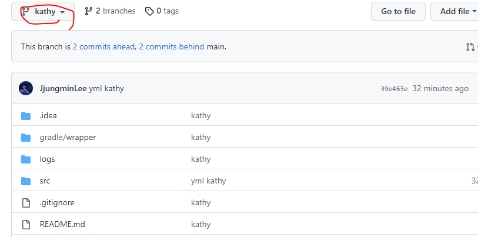
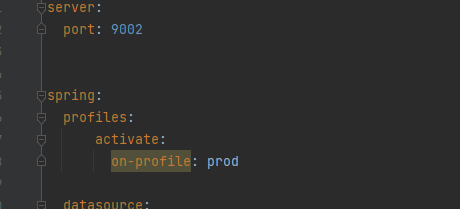
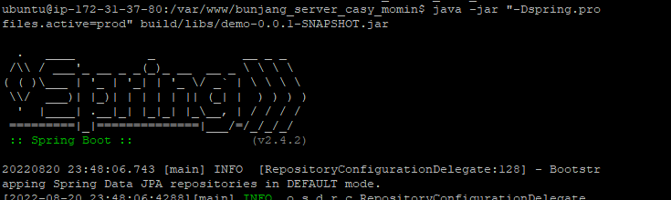
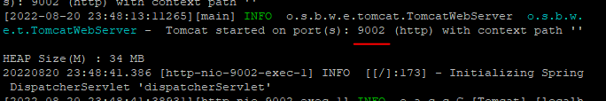
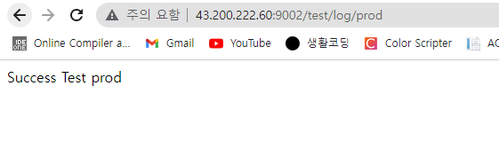

## 8월 20일 개발일지

⭐ 구현 범위 기획

⭐ ERD 설계

https://aquerytool.com/aquerymain/index/?rurl=09c2c811-f2c3-4a25-8751-e3d768fa7ece

비밀번호:82512i

⭐ EC2 prod 서버 구축 -> 구축중

## 8월 21일 개발일지

⭐ ec2 서버 구축 + kathy 브랜치 하나 파서 거기에 내 스프링부트 프로젝트 커밋

⭐ kathy 브랜치의 내용만 ec2에 git clone

sudo chown -R $USER /var/www
git clone -b 브랜치명 repo ssh 주소

를 통해 kathy 브랜치만 ec2에 clone

⭐ 인텔리제이에서 서버 환경분리를 위해 prod,dev 서버 따로 만들고 prod서버는 포트를 9002번 열어주기

⭐ prod만 ec2에 build하기

9002번 포트가 열린것을 확인할 수 있음

⭐ 크롬창에 ipv4주소:9002/test/log/prod 검색

영상 증명 티스토리 링크:https://meaningland02.tistory.com/49
비밀번호:41NjI0Mz

⭐ 차단 테이블, 후기 테이블, 거래 테이블 추가하기

⭐ API 명세서 작성 초안 완료
https://docs.google.com/spreadsheets/d/1al88rl27kN-jMgmkjgHzXS7I48iKWLde_O2_2wwfH48/edit#gid=1496945682

⭐ 더미데이터 수요일까지 마무리 -> 넣는 중 

## 8월 22일 개발일지

⭐ 카테고리 테이블 1:N으로 수정

⭐ main 브랜치 환경 설정 > 커밋 > ec2에 클론 > prod서버 열기 (이걸로 프론트 분들이랑 통신)

main 브랜치에 올라갈 패키지 (최초 환경설정)
