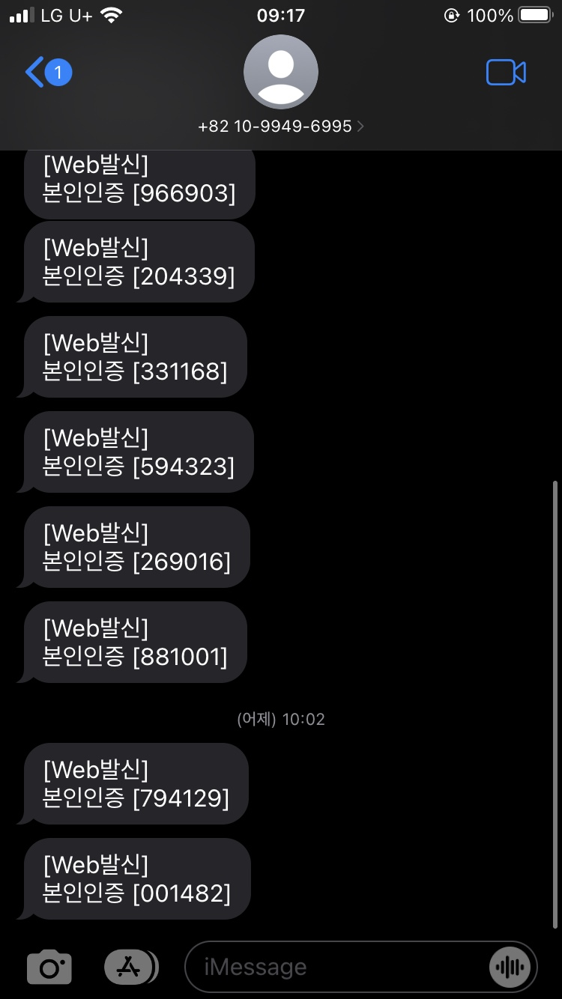
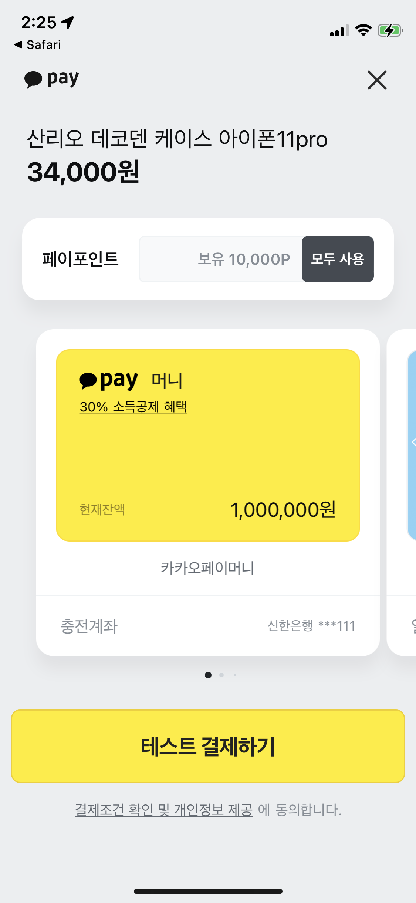

# 본 템플릿의 저작권은 (주)소프트스퀘어드에 있습니다. 상업적 용도의 사용을 금합니다
## 8월 20일 개발일지

⭐ 구현 범위 기획

⭐ ERD 설계

https://aquerytool.com/aquerymain/index/?rurl=09c2c811-f2c3-4a25-8751-e3d768fa7ece

비밀번호:82512i

⭐ EC2 prod 서버 구축 -> 구축중

## 8월 21일 개발일지

⭐ ec2 서버 구축 + kathy 브랜치 하나 파서 거기에 내 스프링부트 프로젝트 커밋

⭐ kathy 브랜치의 내용만 ec2에 git clone

sudo chown -R $USER /var/www
git clone -b 브랜치명 repo ssh 주소

를 통해 kathy 브랜치만 ec2에 clone

⭐ 인텔리제이에서 서버 환경분리를 위해 prod,dev 서버 따로 만들고 prod서버는 포트를 9002번 열어주기

⭐ prod만 ec2에 build하기

9002번 포트가 열린것을 확인할 수 있음

⭐ 크롬창에 ipv4주소:9002/test/log/prod 검색

영상 증명 티스토리 링크:https://meaningland02.tistory.com/49
비밀번호:41NjI0Mz

⭐ 차단 테이블, 후기 테이블, 거래 테이블 추가하기

⭐ API 명세서 작성 초안 완료
https://docs.google.com/spreadsheets/d/1al88rl27kN-jMgmkjgHzXS7I48iKWLde_O2_2wwfH48/edit#gid=1496945682

⭐ 더미데이터 수요일까지 마무리 -> 넣는 중 

## 8월 22일 개발일지

⭐ 카테고리 테이블 1:N으로 수정

⭐ main 브랜치 환경 설정 > 커밋 > ec2에 클론 > prod서버 열기 (이걸로 프론트 분들이랑 통신)

main 브랜치에 올라갈 패키지 (최초 환경설정)

## 8월 23일 개발일지

⭐ 회원가입, 로그인API 작성

⭐ EC2에서 git pull 할 떄 .gradlew/cleanbuild 하고 java --jar 해줘야함!

⭐ DB에 더미데이터 모두 채우기

## 8월 24일 개발일지

⭐ 피드백 반영 -> updateAt 시간 자동갱신

⭐ 무민 : 배송지 추가, 배송지 수정, 배송지 조회 ,회원가입 & 로그인 정규표현식

⭐ 캐시 : 상점후기 , 상점 팔로우 기능 추가 

📌 ISSUE

merge conflict 에러로 인해 ec2서버를 다시 팠다.
정말 험난한 여정이였ㄷr... 앞으론 수동커밋을 할 예정이다. 

## 8월 25일 개발일지

⭐ 무민 : 클라이언트 측 요구에 맞춰 회원가입,로그인 API 다시 설계,
찜하기,찜목록조회,찜취소,개인상점명조회api 추가, 로그아웃, 개인상점명 조회 API 설계, 로그인 dao 함수 정돈   

⭐ 캐시 : prod 서버 ssl 인증서 발급
상품 등록 +validation처리, 상점정보 수정 (URL validation 해결못함),추천상품조회 API 완료
상품상세페이지 거의 완료    

## 8월 26일 개발일지

⭐ 무민:내 피드 팔로잉 목록 조회 API,팔로잉 수 조회 API,팔로워 수 조회 API,팔로워 목록 조회 API
⭐ 캐시 : 추천상품,상품상세페이지 url에 idx 빼고 body로 idx 받을수 있게 수정,
상점 소개/정책/유의사항/후기/차단내역 API 설계

## 8월 27일 개발일지

⭐ 무민: 내피드의 내피드,내피드의 추천,유저의찜수,찜 목록조회 validation추가

⭐ 캐시: 상품 정보/상태 수정, 상품 삭제 기능 추가, 전체 메뉴 조회 기능 추가
지속적으로 클라이언트 분들 요청에 맞춰 수정(추천상품조회에서 해시태그 리스트로 반환,추천상품 조회에서 주소길이가 너무 길다 -> DB에서 수정 )

## 8월 28일 개발일지

⭐ 무민: PATCH 계정설정API , PATCH 유저탈퇴API ,user가 판매중인 상품 내역 조회, user가 판매완료한 상품 내역 조회,차단상점설정,차단상점조회,차단상점삭제,
배송지삭제 , 배송지 관련 api 전체 로직 수정 ,계좌설정,계좌 목록 조회 API,계좌 수정,계좌 삭제

⭐ 캐시: 대분류 카테고리, 소분류 카테고리 완료
클라이언트 분들 요청사항: 서브 이미지 테이블 만들어서 상세페이지, 상품 등록 시 이미지 여러개 업로드 할 수 있게 구현

## 8월 29일 개발일지

⭐ 무민: 거래내역의구매내역,판매내역 api 작성, 네이버 SENS 문자인증 api 적용, 회원가입 api 로직 변경, 비밀번호 정규식 수정

⭐ 캐시: 상품 상세조회 res 변경 , 결제 API 개발 (카카오페이와 연결) , 클라이언트 분들 피드백 바탕으로 DB수정 (교환불가 텍스트 변경, 해시태그 통일, 포인트 컬럼 데이터 변경)
, 광고이미지 테이블 만들어서 광고 이미지 조회하는 API 개발 , 결제승인됐을떄 Tyhmeleaf로 리다이렉션되게 (하는중)

## 8월 30일 개발일지

⭐ 무민 : 배송지 추가,삭제,수정 / 차단상점 삭제/찜 취소/계좌등록,수정,삭제,  
다중쿼리가 들어간 단일 함수 -> 트랜잭션 처리 , jwt 공부 
2차 피드백 내용: (공통) 기본 API,심화 API 구현 잘했다. validation 더 고민해보고, 
멘토께 질문했던 보안적인 문제라던지 기술에 대한 전반적인 궁금증은 앞으로 잘 정리하면 면접때 도움이 많이 될 것. 
* 본인인증 문자 스크린샷 사진 

⭐ 캐시 : 카카오 페이 API 구현 

이정도까지만 구현! (Thymeleaf랑 스프링부트는 연동이 안돼서 우선 보류. -> 피드백 때 굳이 Tyhmeleaf 연결 안돼도 된다고 피드백 받음! )

2차 피드백 내용: (공통) 기본 API,심화 APU 구현 잘했고, 추가적으로 시간이 된다면 validation 더 고민해볼 것!
