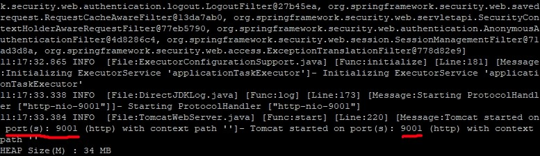
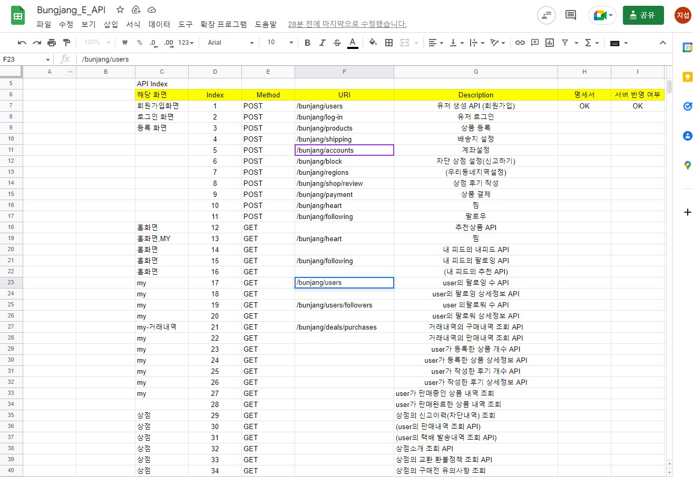
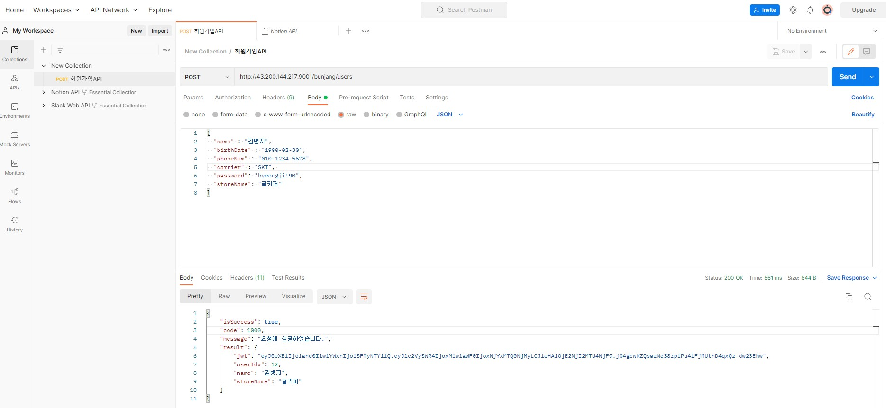
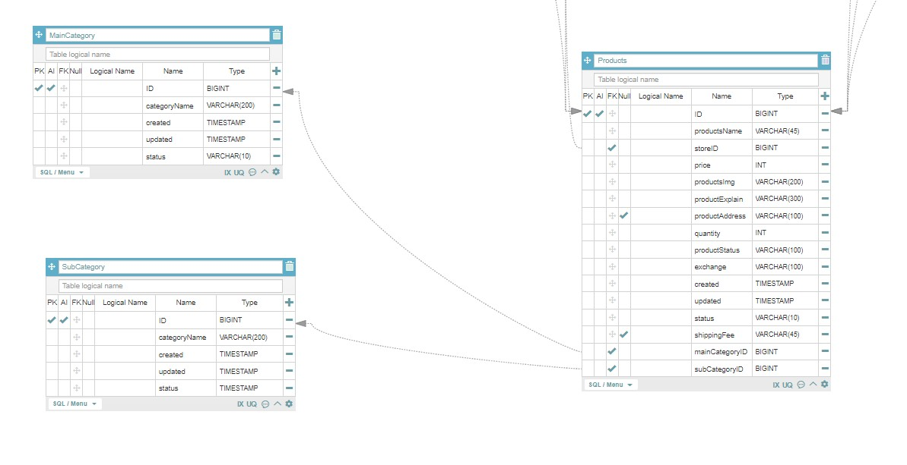

## **8월 20일 개발일지**

⭐ 구현 범위 기획

⭐ ERD 회의

[https://aquerytool.com/aquerymain/index/?rurl=09c2c811-f2c3-4a25-8751-e3d768fa7ece](https://aquerytool.com/aquerymain/index/?rurl=09c2c811-f2c3-4a25-8751-e3d768fa7ece)

비밀번호:82512i

⭐ EC2 서버 구축

## **8월 21일 개발일지**

⭐ 서버 & 스프링부트템플릿 탑재 및 환경구축 → 완료
 

 
1. 윈도우 운영체제 스프링부트 템플릿 다운로드
2. git bash를 통한 git branch -> branch명 : mumin
3. EC2 -> WinScp(Putty) remote 환경 -> nginx 설치
4. /var/www/html/prod 경로에 git clone
5. 컴파일
 

6. prod 서버 9001포트 설정 후 테스트
 

7. 테스트 성공
 
 
⭐ ERD 최종확인, DB sheet 확인 후 API명세서 작성 → 작성중
  

⭐ 더미데이터 작성 → 작성중

⭐ 회원가입API → 시작

## **8월 22일 개발일지**
⭐ 더미데이터 작성 → 작성중

⭐ 회원가입API → 완료
  

⭐ erd kathy님과 상의 후 카테고리, 주소 테이블 수정 → 완료
  

⭐ api uri 네이밍, main branch에 올릴 프로젝트의 패키지 구조 설계 회의 → 1차 완료 (앞으로 수정 가능성 충분)
* JWT 적용관련하여 uri의 /:userIdx 삭제
* 네이밍 할 때 기준을 어떻게 해야할 것인가?
